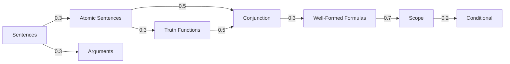

# Introduction to Propositional Logic

> [!WARNING]
> This is an experimental project and a work in progress. It is intended for educational and demonstration purposes.

This is a platform for learning propositional logic. By using a knowledge graph to track what you know, the system schedules reviews using the FSRS v6 algorithm.

## Why this exists

1.  I was fascinated by the [Math Academy](https://www.mathacademy.com/) system and wanted to create something similar.
2.  I wanted a cool project to help land an internship (hiring? [moaaz.ae@proton.me](mailto:moaaz.ae@proton.me)).
3.  For this to be a resource for others who want to start using the "[Math Academy way](https://www.justinmath.com/books/#the-math-academy-way)" to build the most effective platforms for learning.

## Credits

- **[Math Academy](https://www.mathacademy.com/)**: The main inspiration for this system.
- **[Justin Skycak](https://www.justinmath.com/)**: For the book **[The Math Academy Way](https://www.justinmath.com/books/#the-math-academy-way)**, which provides the pedagogical foundation for the platform.

## Core Architecture

The system uses two main data structures.

### Knowledge Graph (DAG)

The curriculum is a directed acyclic graph containing 29 topics. Each topic links to its prerequisites via edges with weights from 0 to 1; a weight of 1 means the prerequisite is practiced completely when the lesson is practiced.



### Student Model

The database stores the state for every user and topic, tracking your progress in the `topic_state` table.

- **Stability**: The number of days until the system predicts a 90% chance of recall.
- **Difficulty**: A value from 1 to 10. It represents how hard the topic is for you.
- **Due Date**: The next time you should review the topic.

## Algorithms

The platform uses five core algorithms.

### 1. Adaptive Diagnostic

The placement test finds your level quickly by using a binary search on milestones.

1.  The system identifies milestones in the topological order of the graph.
2.  It picks the middle milestone and gives you a problem.
3.  If you pass, the search continues in the later half of the graph.
4.  If you fail, it searches the earlier half.
5.  When the pass/fail boundary is found, the system marks all topics below it as "Review" state.

### 2. FSRS v6 Scheduling

The Free Spaced Repetition Scheduler (FSRS) predicts when you will forget a topic. It uses the DSR model (Difficulty, Stability, and Retrievability) to calculate the probability of recall.

- **Retrievability ($R$)**: The probability you remember a topic. It follows a power law.
- **Formula**:

```math
R = \left(1 + \frac{\text{factor} \times \text{days}}{\text{stability}}\right)^{-0.1542}
```

- **Weights**: The algorithm uses 21 trainable parameters ($w_{0 \dots 20}$) to update stability and difficulty after every answer.

### 3. FIRe (Fractional Implicit Repetition)

FIRe updates the stability of parent topics when you solve a child topic, which prevents redundant reviews of simple concepts.

1.  You answer a problem correctly.
2.  The system calculates a "chain weight" by multiplying the edge weights of the prerequisites.
3.  It applies a stability boost to all ancestor topics in the graph.
4.  Boosts decay as the algorithm moves further away from the original topic.

### 4. Scheduler and Task Compression

The scheduler decides which topics to show on your dashboard.

- **Unlocking**: A topic is "New" only if all its prerequisites are in the "Review" state.
- **Compression**: If a topic is due and its child is also due, the system only shows the child.
- **Relearning**: If you fail a prerequisite, the system hides all dependent topics until you fix the prerequisite.

### 5. Logic Parser and Evaluator (`src/lib/logic.ts`)

The `src/lib/logic.ts` module parses LaTeX logic formulas and evaluates them. It checks formula equivalence by generating and comparing truth tables.

- **Parser**: A recursive descent parser converts LaTeX strings into an Abstract Syntax Tree (AST).
- **Operators**: It supports $\neg$, $\land$, $\lor$, $\to$, and $\leftrightarrow$.

## Tech Stack

- [ts-fsrs](https://github.com/open-spaced-repetition/ts-fsrs)
- [SvelteKit (Svelte 5)](https://svelte.dev)
- [PostgreSQL](https://www.postgresql.org) with [Kysely](https://kysely.dev)
- [Better Auth](https://www.better-auth.com)
- [TailwindCSS v4](https://tailwindcss.com)
- [Remark](https://github.com/remarkjs/remark)/[Rehype](https://github.com/rehypejs/rehype) ecosystem with [KaTeX](https://katex.org)
- [Kamal](https://kamal-deploy.org) & [Docker](https://www.docker.com)
- [Vitest](https://vitest.dev) (Unit) and [Playwright](https://playwright.dev) (E2E)

## Project Structure

- `src/lib/curriculum`: Lesson files and problem definitions.
- `src/lib/server/services`: Implementation of the diagnostic, scheduler, and FIRe.
- `src/lib/server/fsrs`: Thin wrapper that configures and re-exports the `ts-fsrs` scheduler.
- `src/lib/logic.ts`: The parser and truth table evaluator.

## Development

Install dependencies:

```bash
pnpm install
```

Start the database and sync the curriculum:

```bash
pnpm db:start:dev
pnpm db:migrate:dev
pnpm db:seed:dev
```

Run the server:

```bash
pnpm dev
```

## License

MIT
